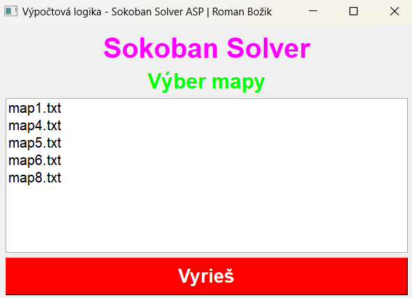
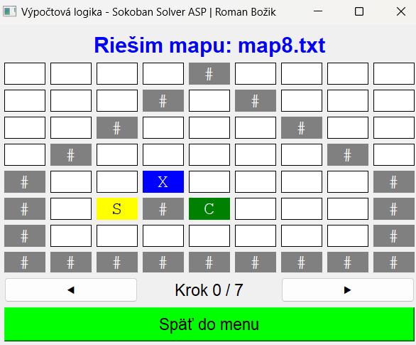

# complog-sokoban

**Project**: Sokoban is a task assignment for computational logic 2024.

## Requirements

To run this project, ensure the following:

1. **Python**: The project uses Python 3.11. You can download it from [python.org](https://www.python.org/).
2. **Dependencies**: Install the required libraries listed in `requirements.txt` by running:
   ```bash
   pip install -r requirements.txt
   ```
3. **Operating System**: The project is recommended to run on Windows with x86_64 CPU architecture. Functionality on other platforms is not guaranteed.


## How to Run project

The Sokoban solver is designed to be easy and intuitive. You can solve any map as long as it meets the following criteria:
- The map is in the correct representation:
  - `#` - wall  
  - `C` - crate (box)  
  - `X` - storage (goal) position  
  - `S` - Sokoban (player)  
  - `s` - Sokoban in storage position  
  - `c` - crate in storage position  
- The map filename contains the word **"map"**.
- The file has a **.txt** extension.
- The file is located in the root directory of the project.

You can also choose from a predefined list of maps available in the project.

To run the project, navigate to the root directory and execute the following command:

   ```bash
   python main.py
   ```
### Using the Sokoban Solver
1. After running the project, the **Main Menu** window will appear.
2. In the main menu, you can select any available map to solve.



3. Once you click the **Solve** button, the solver will process the map and display the solution.



4. You can use the **forward** (▶) and **backward** (◀) buttons to step through the animation and observe the solution conveniently.
5. After solving the map, the application generates a file **`debug.txt`** containing all rules and constraints required to compute the solution for the selected map.
